# Backtest Process Explanation

## How the Backtest Works

```mermaid
flowchart TD
    A["<div style='font-size:15px;padding:15px;width:260px;text-align:left'>Start Backtest</div>"] --> B["<div style='font-size:14px;padding:16px;width:300px;text-align:left'>Fetch Historical Data<br/>Full outputsize from API</div>"]
    B --> C["<div style='font-size:14px;padding:16px;width:340px;text-align:left'>Calculate All Indicators<br/>Candlestick Patterns, RSI,<br/>SMA, Volume</div>"]
    C --> D["<div style='font-size:14px;padding:14px;width:340px;text-align:left'>Initialize Counters<br/>correct=0, total=0,<br/>bullish=0, bearish=0</div>"]
    D --> E["<div style='font-size:14px;padding:16px;width:320px;text-align:left'>Loop Each Candle<br/>i = start_idx → len-1</div>"]
    E --> F["<div style='font-size:14px;padding:12px;width:240px;text-align:left'>Get Candle i</div>"]
    F --> G["<div style='font-size:14px;padding:12px;width:260px;text-align:left'>Calculate Score for i</div>"]
    G --> H{"<div style='font-size:15px;padding:14px;width:200px;text-align:left'>Pattern Score</div>"}
    H --> H1["<div style='font-size:13px;padding:12px;width:280px;text-align:left'>Engulfing: +3 / -3</div>"]
    H --> H2["<div style='font-size:13px;padding:12px;width:280px;text-align:left'>Morning/Evening Star: +4 / -4</div>"]
    H --> H3["<div style='font-size:13px;padding:12px;width:280px;text-align:left'>Hammer: +2</div>"]
    H --> H4["<div style='font-size:13px;padding:12px;width:280px;text-align:left'>Doji: +1</div>"]
    H --> H5["<div style='font-size:13px;padding:12px;width:280px;text-align:left'>3 Soldiers/Crows: +3 / -3</div>"]
    H --> H6["<div style='font-size:13px;padding:12px;width:280px;text-align:left'>Harami: +2</div>"]
    H --> H7["<div style='font-size:13px;padding:12px;width:280px;text-align:left'>Piercing/Dark Cloud: +2 / -2</div>"]
    H1 & H2 & H3 & H4 & H5 & H6 & H7 --> I{"<div style='font-size:14px;padding:14px;width:200px;text-align:left'>Add Momentum?</div>"}
    I -->|Yes| J["<div style='font-size:13px;padding:14px;width:280px;text-align:left'>RSI Score<br/>Oversold +2<br/>Overbought -2</div>"]
    J --> K["<div style='font-size:13px;padding:12px;width:280px;text-align:left'>Volume Confirmation<br/>High vol +1 / -1</div>"]
    K --> L{"<div style='font-size:14px;padding:14px;width:200px;text-align:left'>Add Trend?</div>"}
    I -->|No| L
    L -->|Yes| M["<div style='font-size:13px;padding:14px;width:340px;text-align:left'>Trend Score<br/>Above SMAs +2 / Below -2<br/>Golden/Death Cross +1/-1</div>"]
    M --> N["<div style='font-size:14px;padding:12px;width:260px;text-align:left'>Total Score Ready</div>"]
    L -->|No| N
    N --> O{"<div style='font-size:15px;padding:14px;width:220px;text-align:left'>Score > Threshold?</div>"}
    O -->|Yes| P["<div style='font-size:15px;padding:14px;width:200px;text-align:left;color:green;font-weight:bold'>BULLISH</div>"]
    O -->|No| Q{"<div style='font-size:15px;padding:14px;width:240px;text-align:left'>Score < -Threshold?</div>"}
    Q -->|Yes| R["<div style='font-size:15px;padding:14px;width:200px;text-align:left;color:red;font-weight:bold'>BEARISH</div>"]
    Q -->|No| S["<div style='font-size:14px;padding:12px;width:200px;text-align:left'>NEUTRAL<br/>Skip</div>"]
    P & R --> T["<div style='font-size:14px;padding:12px;width:260px;text-align:left'>Check Next Candle i+1</div>"]
    S --> E
    T --> U{"<div style='font-size:14px;padding:14px;width:280px;text-align:left'>next.close > current.close?</div>"}
    U -->|Yes| V["<div style='font-size:14px;padding:10px;width:180px;text-align:left'>Actual BULLISH</div>"]
    U -->|No| W["<div style='font-size:14px;padding:10px;width:180px;text-align:left'>Actual BEARISH</div>"]
    V & W --> X{"<div style='font-size:15px;padding:14px;width:220px;text-align:left'>Prediction == Actual?</div>"}
    X -->|Yes| Y["<div style='font-size:14px;padding:12px;width:200px;text-align:left;color:green'>correct++<br/>total++</div>"]
    X -->|No| Z["<div style='font-size:14px;padding:12px;width:180px;text-align:left;color:red'>total++</div>"]
    Y & Z --> AA["<div style='font-size:14px;padding:12px;width:260px;text-align:left'>Update Stats by Type</div>"]
    AA -->|Bullish| AB["<div style='font-size:13px;padding:12px;width:300px;text-align:left'>bullish_total++<br/>if correct → bullish_correct++</div>"]
    AA -->|Bearish| AC["<div style='font-size:13px;padding:12px;width:300px;text-align:left'>bearish_total++<br/>if correct → bearish_correct++</div>"]
    AB & AC --> AD{"<div style='font-size:14px;padding:14px;width:200px;text-align:left'>More Candles?</div>"}
    AD -->|Yes| E
    AD -->|No| AE["<div style='font-size:14px;padding:12px;width:260px;text-align:left'>Calculate Accuracy</div>"]
    AE --> AF["<div style='font-size:14px;padding:14px;width:320px;text-align:left'>Overall Accuracy<br/>correct / total × 100%</div>"]
    AF --> AG["<div style='font-size:14px;padding:12px;width:300px;text-align:left'>Bullish Accuracy</div>"]
    AG --> AH["<div style='font-size:14px;padding:12px;width:300px;text-align:left'>Bearish Accuracy</div>"]
    AH --> AI["<div style='font-size:15px;padding:16px;width:320px;text-align:left;color:green;font-weight:bold'>Display Results<br/>+ Rating</div>"]
    AI --> AJ["<div style='font-size:15px;padding:16px;width:260px;text-align:left'>End Backtest</div>"]

    style A fill:#e1f5ff,stroke:#333
    style AJ fill:#e1f5ff,stroke:#333
    style O fill:#fff4e1,stroke:#333
    style Q fill:#fff4e1,stroke:#333
    style X fill:#fff4e1,stroke:#333
    style Y fill:#d4edda,stroke:#333
    style Z fill:#f8d7da,stroke:#333
    style P fill:#d4edda,stroke:#333
    style R fill:#f8d7da,stroke:#333
    style AI fill:#d4edda,stroke:#333
```



## Key Concepts

### 1. **Window Sliding Approach**
The backtest uses a sliding window where:
- **Current Candle (i)**: Used to generate signals and calculate prediction
- **Next Candle (i+1)**: Used to verify if the prediction was correct

### 2. **Score Calculation**
For each candle, a numerical score is built up:
- Positive scores indicate bullish sentiment
- Negative scores indicate bearish sentiment
- The magnitude indicates confidence level

### 3. **Prediction Logic**
```
if score > threshold:  → BULLISH prediction
elif score < -threshold:  → BEARISH prediction
else:  → NEUTRAL (skipped in accuracy calculation)
```

### 4. **Validation**
Each prediction is compared against actual price movement:
- If next candle closes **higher**: Actual direction = BULLISH
- If next candle closes **lower**: Actual direction = BEARISH
- Match = correct prediction, otherwise incorrect

### 5. **Performance Metrics**
- **Overall Accuracy**: What % of all predictions were correct
- **Bullish Accuracy**: What % of bullish predictions came true
- **Bearish Accuracy**: What % of bearish predictions came true

### 6. **Why This Works**
- Tests the strategy on **real historical data**
- Simulates **forward-looking predictions** (no peeking at future data)
- Provides **statistical validation** of the indicator's effectiveness
- Separates **signal types** to identify which direction the indicator predicts better

### 7. **Improvements from Enhanced Version**
- **RSI**: Filters out patterns that go against momentum
- **Volume**: Confirms patterns have real market conviction
- **Trend**: Ensures predictions align with broader market direction
- **Threshold**: Allows filtering for higher confidence signals only
